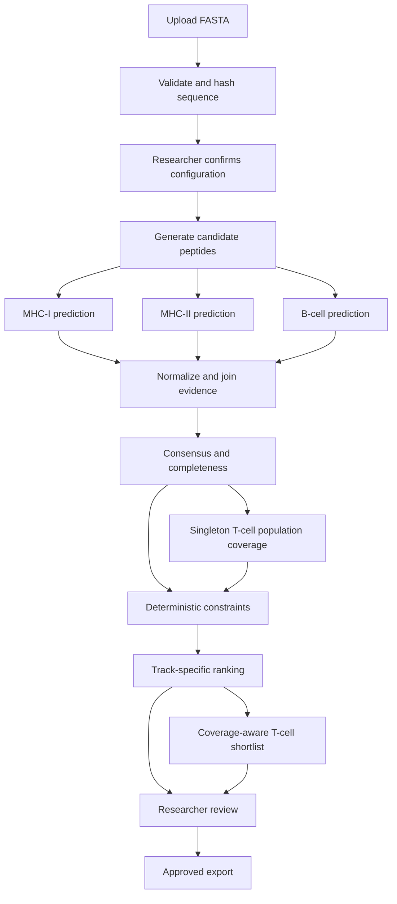

# ImmunoGraph

**An MCP-native, multi-agent decision-support system for reliable vaccine epitope prioritization.**

ImmunoGraph turns a protein sequence and a researcher-approved analysis configuration into a ranked, evidence-backed epitope shortlist. The Fastify application service invokes one separately running NitroStack MCP server over Streamable HTTP. It prefers configured live scientific predictors, can use an unmistakably synthetic deterministic demonstration path when demo mode permits it, and retains exact approved fixture replay as the final fallback.

> ImmunoGraph is a computational prioritization tool, not a vaccine-discovery or clinical-decision system. Its outputs require independent expert review and experimental validation.

## The problem

Researchers routinely move data among MHC-I, MHC-II, B-cell, and population-coverage tools. Those tools expose different formats and score directions, can disagree, and often leave the researcher to reconcile spreadsheets manually. This makes candidate selection slow, hard to audit, and difficult to reproduce.

ImmunoGraph addresses one focused question:

> Which computationally predicted epitopes have enough consistent evidence to justify further experimental investigation?

## What the MVP does

1. Accepts a protein FASTA sequence plus project metadata.
2. Validates and hashes the normalized sequence.
3. Generates valid MHC-I and MHC-II peptide windows.
4. Runs approved IEDB MHC-I/MHC-II predictors, optional local MHCflurry MHC-I prediction, plus the fixture-only MVP GraphBepi path.
5. Resolves `LIVE`, `CACHED`, `SYNTHETIC`, and `FIXTURE` evidence according to the immutable run policy.
6. Normalizes predictor outputs without changing the underlying raw values.
7. Computes binding, consensus, evidence completeness, and estimated population-coverage evidence.
8. Applies deterministic constraint rules before ranking.
9. Ranks candidates within scientifically compatible tracks.
10. Pauses for researcher review and approval.
11. Exports the shortlist, rejected candidates, visualizations, evidence graph, and workflow trace.

## What it deliberately does not do

- claim to discover or validate a vaccine;
- infer wet-lab efficacy, safety, or clinical outcomes;
- generate binding scores with an LLM;
- override a deterministic constraint with model prose;
- perform docking, molecular dynamics, de novo protein folding, or vaccine-construct design in the MVP;
- silently mix live, cached, and fixture results.
- calculate conservation in the MVP; conservation is reserved for Product Phase 2 (post-MVP).

See [LIMITATIONS.md](docs/LIMITATIONS.md) for the full boundary.

## Hybrid scientific execution

Every connector result carries a visible source status:

| Status | Meaning |
|---|---|
| `LIVE` | Produced by a live configured predictor in this workflow run. |
| `CACHED` | Reused from a previously successful live call with an exact cache-key match. |
| `SYNTHETIC` | Generated by the deterministic offline demonstration predictor. `scientificUse=false`; not a biological prediction. |
| `FIXTURE` | Loaded from a curated, versioned demo fixture after policy-approved fallback. |
| `FAILED` | No valid result was produced. The branch is incomplete and cannot be presented as live evidence. |

The UI must show the status beside each predictor. Fixture-derived outputs are never relabeled as live or cached scientific evidence.

Each run also records an execution mode: `LIVE`, `SYNTHETIC`, `FIXTURE`, or `HYBRID`. `AUTO` is a requested mode, not a result mode. Synthetic and hybrid runs display a non-dismissible **OFFLINE SYNTHETIC DEMONSTRATION — NOT SCIENTIFIC OUTPUT** notice in the run UI and exported reports.

GraphBepi is deliberately fixture-only in the MVP. The system never attempts a live GraphBepi execution and never reports GraphBepi as `LIVE` or `CACHED`. A GraphBepi run requires an exact approved fixture match or the B-cell branch fails explicitly.

MHCflurry is supported as an optional local MHC-I connector. It is disabled by default and only reports `LIVE` after the MHCflurry CLI and prediction models are installed in the runtime and `MHCFLURRY_ENABLED=true` is set.

For local development, install and verify MHCflurry with:

```bash
npm run connectors:install:mhcflurry
npm run connectors:check:mhcflurry
```

Then set `MHCFLURRY_ENABLED=true` and point `MHCFLURRY_COMMAND` at the printed `mhcflurry-predict-scan` executable. IEDB live mode is enabled with `IEDB_LIVE_ENABLED=true`.

## Workflow



## Architecture at a glance

```text
React + Vite + shadcn/ui
            |
        Fastify API
            |
  Deterministic workflow supervisor
            |
       NitroStack MCP server
  +---------------------------------------+
  | Prediction | Evidence | Constraint    |
  | Report tools and resources            |
  +---------------------------------------+
            |
 Live adapters | SQLite cache | Fixtures
            |
       Prisma + SQLite
```

The MVP runs one NitroStack MCP server process on `http://127.0.0.1:3001/mcp`. Prediction, Evidence, Constraint, and Report remain internal capability modules. The API uses the MCP SDK over HTTP; it does not import or call MCP controllers directly.

## Run locally

```powershell
npm install
npm run db:migrate
npm run db:seed
npm run dev
```

Run `npm run db:generate` after a dependency-only install or a Prisma schema
change. Production builds perform this generation automatically after the full
workspace source has been copied.

`npm run dev` starts the web app, Fastify API, and NitroStack MCP server together. Defaults are web `5173`, API `3000`, and MCP `3001`. The API endpoint can be changed with `MCP_SERVER_URL`.

## NitroStack Cloud deployment

ImmunoGraph deploys to NitroStack Cloud as an MCP-first app. The cloud artifact is
`apps/mcp`; the React workspace and Fastify API remain separately deployable.
Follow the verified [NitroCloud deployment guide](docs/NITROCLOUD_DEPLOYMENT.md)
for the current CLI limitations, dashboard settings, environment variables, and
post-deployment checks.

Cloud target:

```text
NitroStack Cloud
  apps/mcp
    /mcp          Streamable HTTP MCP endpoint
    /mcp/health   NitroStack health probe
    /sse          legacy SDK SSE endpoint, when enabled by NitroStack
```

Recommended cloud environment:

```env
NODE_ENV=production
HOST=0.0.0.0
PORT=3001
MCP_TRANSPORT_TYPE=dual
IEDB_LIVE_ENABLED=true
IEDB_POPULATION_COVERAGE_ENABLED=true
IEDB_POPULATION_COVERAGE_SCRIPT_PATH=/opt/iedb/population_coverage/calculate_population_coverage.py
IEDB_POPULATION_COVERAGE_PYTHON_COMMAND=python3
MHCFLURRY_ENABLED=false
DEMO_MODE=true
```

Verify and build only the MCP app:

```powershell
npm run nitro:verify
npm start
```

Docker deployment:

```powershell
docker build -f Dockerfile.mcp -t immunograph-mcp .
docker run --rm -p 3001:3001 --env-file .env.production.example immunograph-mcp
```

## Complete production stack

The web application, REST API, MCP server, SQLite database, migrations, seed data, and
persistent artifact storage can be started together:

```powershell
docker compose up --build -d
```

Open `http://localhost:8080`. Set `IMMUNOGRAPH_PORT` to publish a different port.
The API container applies migrations before startup, seed operations are idempotent, and
SQLite plus generated artifacts are retained in the `immunograph-data` volume.

For an offline deployment, keep `IEDB_LIVE_ENABLED=false`, `MHCFLURRY_ENABLED=false`, and
`DEMO_MODE=true`. Enable live connectors only after their runtime and scientific-data
governance requirements have been verified.

The initial cloud deployment should keep `MHCFLURRY_ENABLED=false` unless the
runtime has Python, the MHCflurry CLI, and downloaded models installed. IEDB is
the primary live cloud connector because it only requires outbound HTTPS.
Population coverage uses IEDB's official standalone Python package because the
stable Tools API does not publish it as a normal REST endpoint. The MCP Docker
image installs that package under `/opt/iedb`; local development can install it
with `npm run connectors:install:iedb-population`.

## Technology baseline

- Frontend: React, Vite, TypeScript, Tailwind CSS, shadcn/ui
- Charts and graphs: Recharts, React Flow
- API: Fastify, TypeScript, Zod, Pino
- MCP: NitroStack
- Persistence: SQLite, Prisma
- Package manager: npm workspaces
- Tests: Vitest

Dependency versions are pinned by the future lockfile. The implementation must verify current NitroStack APIs against the official documentation before scaffolding.

## Planned repository layout

```text
apps/
  web/                 React/Vite researcher workspace
  api/                 Fastify REST API and application services
  mcp/                 One NitroStack HTTP server with four logical tool groups
packages/
  shared/              REST schemas and shared types
  algorithms/          Pure deterministic scientific algorithms
  database/            Prisma schema, repositories, profiles, fixtures, references
data/
  fixtures/            Curated deterministic demo cases
  reference/           Amino-acid, allele, and constraint reference data
  schemas/             Dataset schemas
docs/                  Generated diagrams and future operational guides
```


## Authoritative sources

- [NitroStack documentation](https://docs.nitrostack.ai/)
- [IEDB Tools API](https://tools.iedb.org/main/tools-api/)
- [IEDB Population Coverage standalone package](https://tools.iedb.org/population/download/)
- [MHCflurry documentation](https://openvax.github.io/mhcflurry/)
- [GraphBepi publication and implementation reference](https://pubmed.ncbi.nlm.nih.gov/37039829/)

Scientific connectors must record the actual method, version, parameters, source URL or executable identity, and execution status used for each result.
