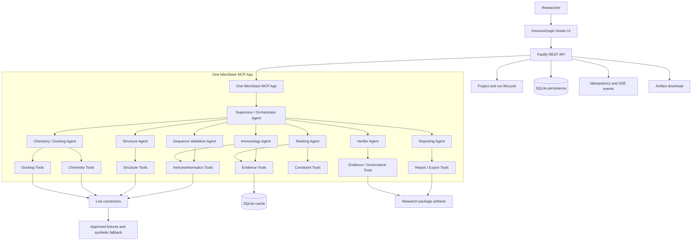

<p align="center">
  
</p>

# ImmunoGraph Studio

**An MCP-first, multi-agent research workspace for auditable epitope prioritization, structure review, docking preparation, and evidence-governed scientific reporting.**

ImmunoGraph Studio helps a researcher move from a pathogen protein sequence to a reviewable computational research package. It combines a React researcher workspace, a Fastify workflow API, and one NitroStack MCP app that exposes typed scientific tools for immunoinformatics, evidence synthesis, structure, chemistry, docking, orchestration, and export.

The cloud-facing artifact is the NitroStack MCP app. The web UI and REST API provide the full local product experience, while the MCP app is the deployable capability surface for NitroStack Cloud and external MCP hosts.

> ImmunoGraph is computational decision-support software. It does not validate a vaccine, predict clinical efficacy, establish safety, or replace expert scientific review. All outputs require independent expert review and experimental validation.

## Why This Exists

The COVID-19 pandemic showed how quickly biological sequence data can arrive, but also how fragmented computational interpretation remains. A researcher may need separate tools for FASTA validation, epitope prediction, population coverage, protein structure lookup, molecular preparation, docking, evidence review, and final reporting.

That fragmentation creates four problems:

| Problem | ImmunoGraph response |
| --- | --- |
| Disconnected scientific tools | One MCP app exposes typed tools behind a single interface. |
| Hard-to-reproduce analysis | Every run records inputs, configuration, provenance, approvals, and checksums. |
| Opaque fallback behavior | Results are explicitly labeled as `LIVE`, `CACHED`, `SYNTHETIC`, `FIXTURE`, or `FAILED`. |
| Manual evidence reconciliation | Deterministic ranking, consensus, confidence, constraints, and reports are produced from structured evidence. |

## What It Does

ImmunoGraph turns protein FASTA input and a researcher-approved configuration into an evidence-backed candidate shortlist and exportable research package.

Current capabilities include:

- FASTA validation, normalization, hashing, and peptide generation.
- MHC-I, MHC-II, B-cell, population coverage, consensus, confidence, and ranking workflows.
- Live-capable IEDB binding and population coverage connectors.
- Optional local MHCflurry connector when the CLI and models are installed.
- Fixture-only GraphBepi path for MVP B-cell demonstration reliability.
- Structure tools for RCSB PDB, AlphaFold DB, epitope mapping, surface accessibility, confidence, pockets, and Mol* view-state generation.
- Chemistry and docking tools for PubChem, compound validation, descriptors, ligand/receptor preparation, docking orchestration, pose clustering, and interaction extraction.
- Bounded agent workflow with optional LLM-backed routing and deterministic fallback.
- Research package ZIP export containing inputs, predictions, candidates, construct files, docking artifacts, evidence, reports, approvals, audit events, CSV exports, and checksums.

## Architecture



The API owns workflow lifecycle, persistence, transactions, idempotency, and browser-facing contracts. The MCP app owns typed scientific capabilities. The algorithm package remains pure TypeScript with no database, HTTP, Fastify, NitroStack, or LLM dependency.

## Repository Map - According to the branches.

| Path | Responsibility |
| --- | --- |
| `apps/web/` | React/Vite researcher workspace with dashboard, project views, workflow visualization, candidates, evidence, reports, settings, and diagnostics. |
| `apps/api/` | Fastify REST API, application services, workflow lifecycle, repositories, SSE events, artifacts, diagnostics, and MCP delegation. |
| `apps/mcp/` | NitroStack MCP app, bounded agent workflow, scientific tool controllers, connectors, provenance, and export tools. |
| `packages/shared/` | Zod schemas, shared DTOs, API contracts, and typed cross-package models. |
| `packages/algorithms/` | Pure deterministic algorithms for validation, peptides, normalization, consensus, ranking, confidence, overlap handling, and optimization. |
| `packages/database/` | Prisma schema, SQLite repositories, migrations, seed support, fixture/profile loaders, and validation. |
| `data/fixtures/` | Approved deterministic demo fixtures for offline replay. |
| `data/profiles/` | Immutable MVP profiles and biological constraint configuration. |
| `data/reference/` | Small local reference datasets such as amino acid and HLA allele references. |
| `docs/` | Product, architecture, API, MCP, data, agent, deployment, limitation, and testing documentation. |
| `assets/` | README and presentation assets. |

## MCP Tool Surface

The NitroStack MCP app exposes the project as one deployable app with multiple logical laboratories.

| Tool group | Representative tools |
| --- | --- |
| Immunoinformatics | `validate_sequence`, `generate_candidate_peptides`, `predict_mhci`, `predict_mhcii`, `predict_bcell`, `predict_synthetic_binding` |
| Evidence | `normalize_scores`, `compute_consensus`, `compute_consensus_batch`, `calculate_population_coverage`, `rank_candidates`, `optimize_shortlist_coverage`, `calibrate_confidence`, `optimize_construct_genetic` |
| Constraints | `detect_overlapping_epitopes`, `remove_duplicate_candidates`, `validate_thresholds`, `categorize_candidates`, `apply_constraint_rules` |
| Structure | `fetch_structure`, `validate_structure`, `map_epitopes_to_structure`, `calculate_surface_accessibility`, `calculate_structure_confidence`, `detect_binding_pockets`, `create_molstar_view` |
| Chemistry | `fetch_compound`, `validate_compound`, `deduplicate_compounds`, `calculate_molecular_descriptors`, `prepare_ligand` |
| Docking | `prepare_receptor`, `validate_docking_box`, `run_docking`, `cluster_docking_poses`, `extract_interactions` |
| Agent workflow | `describe_agentic_workflow`, `run_agentic_workflow`, `chat_with_research_agent` |
| Reports and export | `generate_report`, `export_candidates`, `visualize_results`, `explain_candidate`, `export_workflow_trace`, `export_research_package` |

Each tool validates input schemas, returns structured output, and preserves provenance. Synthetic and fixture outputs are never relabeled as live scientific predictions.

## Agentic Workflow

ImmunoGraph uses bounded agents inside the single MCP app. Agents coordinate tool use; they do not invent scientific measurements.

| Agent | Main responsibility |
| --- | --- |
| Supervisor / Orchestrator | Build a bounded plan, route work to allowed agents, enforce gates, and emit workflow trace events. |
| Sequence Validation Agent | Validate FASTA input, normalize sequence data, and generate candidate peptide windows. |
| Immunology Agent | Run or route MHC-I, MHC-II, B-cell, synthetic, fixture, and coverage tools according to execution policy. |
| Structure Agent | Fetch structures, validate PDB/mmCIF content, map epitopes, compute structure confidence, and prepare Mol* views. |
| Chemistry / Docking Agent | Fetch compounds, validate molecules, prepare ligands/receptors, validate docking boxes, and collect docking evidence. |
| Ranking Agent | Combine evidence, apply constraints, rank candidates, calibrate confidence, and optimize shortlist/construct proposals. |
| Verifier Agent | Check schemas, provenance, source labels, missing evidence, and approval boundaries before reporting. |
| Reporting Agent | Generate summaries, exports, limitations, trace files, and the final research package. |

When `LLM_ENABLED=true` and credentials are configured, LLM-backed agents may plan, route, summarize, and verify within strict tool allowlists. If LLM support is absent or invalid, deterministic routing remains available for safe workflows.

## Execution Modes And Provenance

Every result carries an explicit source status:

| Status | Meaning |
| --- | --- |
| `LIVE` | Produced by a configured live connector during the run. |
| `CACHED` | Reused from an exact cache match for a previous validated live result. |
| `SYNTHETIC` | Produced by a deterministic offline demonstration predictor. `scientificUse=false`. |
| `FIXTURE` | Replayed from an approved exact-match fixture. |
| `FAILED` | No valid result was produced for that branch. |

Run-level execution resolves to `LIVE`, `SYNTHETIC`, `FIXTURE`, or `HYBRID`. `AUTO` is a requested policy mode, not an evidence status.

The default fallback policy is:

```text
Validate input
  |
  v
Try live connector when enabled and available
  |
  |-- success --> persist provenance and cache
  |
  |-- unavailable / timeout / rate limit
          |
          v
     synthetic allowed?
          |
          |-- yes --> deterministic synthetic demonstration output
          |
          |-- no
                |
                v
           exact approved fixture?
                |
                |-- yes --> replay fixture
                `-- no  --> fail closed
```

GraphBepi remains fixture-only in the MVP. MHCflurry reports `LIVE` only after its CLI and models are installed and `MHCFLURRY_ENABLED=true` is configured.

## Research Package Export

The final deliverable is a reviewable archive:

```text
research-package.zip
├── manifest.json
├── project.json
├── run.json
├── configuration.json
├── inputs/
│   ├── original-fasta.fasta
│   ├── normalized-sequence.json
│   └── input-checksums.json
├── predictions/
│   ├── mhci.json
│   ├── mhcii.json
│   ├── bcell.json
│   ├── population-coverage.json
│   └── connector-provenance.json
├── candidates/
│   ├── ranked-candidates.json
│   ├── shortlisted-candidates.json
│   ├── rejected-candidates.json
│   └── candidate-evidence-links.json
├── construct/
│   ├── construct.fasta
│   ├── construct.json
│   └── construct-optimization.json
├── evidence/
│   ├── evidence-graph.json
│   ├── workflow-trace.json
│   ├── approvals.json
│   └── audit-events.json
├── reports/
│   ├── summary.md
│   ├── report.json
│   ├── candidates.csv
│   └── limitations.md
└── checksums.json
```

This package is designed for review, not for automatic biological claims.
## Screenshots


### Research Projects Dashboard


The Research Projects dashboard is the main ImmunoGraph workspace. It gives a quick overview of the current research state, including total projects, recent prioritization runs, and connector health.

From this screen, users can:
- Create a new immunoinformatics project.
- Upload a FASTA sequence.
- Open a recent project.
- View diagnostics for MCP/API connector health.
- Track run status such as queued, complete, failed, or awaiting shortlist approval.
- Review project provenance, source mode, and last updated date.

This view is designed for managing multiple epitope prioritization studies from one workspace.

---


### Generated Artifacts

The Generated Artifacts screen shows the output files created by ImmunoGraph after a workflow run.

Each artifact includes:
- File name
- Artifact type, such as `CSV`, `JSON`, `EVIDENCE_GRAPH`, or `WORKFLOW_TRACE`
- File size
- SHA-256 checksum
- Download action

This makes every generated research output inspectable, traceable, and reproducible. Users can download reports, evidence graphs, and workflow traces for downstream analysis, validation, or submission.

---

### Docking Visualization


The docking visualization shows actual molecular docking output generated by ImmunoGraph.

This screen visualizes:
- RCSB `1UYD` receptor structure
- PubChem `CID 2244` ligand
- Docked poses from AutoDock Vina
- Contact geometry inferred from PyMOL
- Nearby pocket residues
- Polar contact distances

Each pose includes a receptor ribbon view, docked ligand position, nearby residue labels, and inferred polar contacts. The visualization helps researchers inspect whether a ligand pose is structurally plausible and which residues contribute to binding interactions.

---

### Docking Pose Comparison


The docking pose comparison presents multiple docked ligand conformations side by side as separate ranked poses.

For each pose, ImmunoGraph reports:
- Closest nearby residues
- Minimum residue distances
- Ligand-residue polar contacts
- Docking pocket orientation
- Visual receptor-ligand alignment

This helps compare candidate poses and understand how binding geometry changes across docking outputs.
## Prerequisites

Install only the components required for the capabilities you plan to use.

| Capability | Requirements |
| --- | --- |
| Core workspace | Node.js `20.19.x`, npm `10.x` |
| Database | SQLite through Prisma; no separate database server required |
| IEDB live binding | Outbound HTTP access and `IEDB_LIVE_ENABLED=true` |
| IEDB population coverage | IEDB standalone population coverage package or configured compatible endpoint |
| MHCflurry | Python runtime, MHCflurry CLI, downloaded models, and `MHCFLURRY_ENABLED=true` |
| Structure lookup | Outbound HTTP access to RCSB PDB and AlphaFold DB |
| Chemistry lookup | Outbound HTTP access to PubChem |
| Local chemistry/docking | Open Babel, RDKit, AutoDock Vina, PLIP, fpocket, and FreeSASA where those live paths are enabled |
| NitroStack Cloud | GitHub import flow, Node.js 20 runtime, and repository-root deployment |

## 🧬 Scientific Capabilities

Our platform is organized into specialized scientific modules, each responsible for a distinct stage of the vaccine and therapeutic discovery pipeline.

### Immunology

Core immunoinformatics capabilities for identifying and evaluating immune targets.

| Capability | Description |
|------------|-------------|
| FASTA Validation | Validates protein sequences before downstream analysis. |
| Peptide Generation | Generates candidate peptide fragments from protein sequences. |
| MHC-I Prediction | Predicts Class I HLA binding for CD8+ T-cell responses. |
| MHC-II Prediction | Predicts Class II HLA binding for CD4+ T-cell responses. |
| B-cell Prediction | Identifies potential antibody-recognized epitopes. |
| Population Coverage | Estimates global and regional HLA population coverage. |
| Consensus Scoring | Combines multiple prediction models into a unified ranking. |

---

### Structural Biology

Structure-aware analysis for validating epitope accessibility and protein context.

| Capability | Description |
|------------|-------------|
| Protein Structure Retrieval | Retrieves experimentally determined protein structures. |
| AlphaFold Support | Utilizes AlphaFold predicted protein models. |
| PDB Support | Integrates Protein Data Bank (PDB) structures. |
| Surface Accessibility | Determines whether epitopes are surface exposed. |
| Confidence Analysis | Evaluates structural prediction confidence. |
| Epitope Mapping | Maps predicted epitopes onto 3D protein structures. |

---

### Chemistry & Docking

Computational chemistry workflows for molecular interaction analysis.

| Capability | Description |
|------------|-------------|
| Ligand Preparation | Cleans and optimizes ligand structures for docking. |
| Protein Preparation | Prepares receptor structures for simulation. |
| Molecular Docking | Predicts ligand–protein binding orientations. |
| Interaction Analysis | Identifies hydrogen bonds, hydrophobic contacts, and key interactions. |
| Binding Evaluation | Scores and ranks docking results based on predicted affinity. |

---

### Evidence & Governance

Scientific traceability and reproducibility across the discovery pipeline.

| Capability | Description |
|------------|-------------|
| Provenance Tracking | Records the origin of every scientific result. |
| Evidence Graph | Links predictions, datasets, models, and supporting evidence. |
| Candidate Ranking | Prioritizes candidates using multi-factor evidence scoring. |
| Audit Trail | Maintains complete execution history for reproducibility. |
| Report Generation | Produces publication-ready scientific reports. |

---

## 🎯 Design Principles

The platform is built around modern AI engineering and computational biology best practices.

| Principle | Description |
|-----------|-------------|
| Single Responsibility Principle | Each agent and MCP performs one well-defined scientific task. |
| Explainable AI | Every prediction is accompanied by supporting evidence and rationale. |
| Modular MCP Architecture | Independent scientific services communicate through standardized MCP interfaces. |
| Scientific Reproducibility | Every experiment can be reproduced with identical inputs and parameters. |
| Evidence-backed Decision Support | Recommendations are derived from verifiable scientific evidence rather than opaque model outputs. |
| Human-in-the-loop Research | Researchers retain full oversight and control over every stage of the workflow. |
## Quick Start

```powershell
npm install
npm run db:migrate
npm run db:seed
npm run dev
```

Default local services:

| Service | URL |
| --- | --- |
| Web UI | `http://localhost:5173` |
| REST API | `http://127.0.0.1:3000` |
| MCP endpoint | `http://127.0.0.1:3001/mcp` |

Useful development commands:

```powershell
npm run typecheck
npm run lint
npm test
npm run build
npm run nitro:verify
```

## Configuration

Copy `.env.example` to `.env` for local development. NitroStack Cloud values should be configured in the cloud environment.

### Core Runtime

| Variable | Default | Purpose |
| --- | --- | --- |
| `NODE_ENV` | `development` | Runtime mode. Use `production` in NitroStack Cloud. |
| `HOST` | `127.0.0.1` locally, `0.0.0.0` in production | HTTP bind host. |
| `PORT` / `MCP_PORT` | `3001` | MCP HTTP port. NitroStack Cloud may supply `PORT`. |
| `MCP_TRANSPORT_TYPE` | `http` | MCP transport. Use `http` for NitroStack Cloud. |
| `LOG_LEVEL` | `info` | Structured logging level. |
| `EXECUTION_MODE` | `HYBRID` | Requested workflow policy. |
| `DEMO_MODE` | `true` for demo-friendly operation | Allows deterministic demo-safe fallback when configured. |
| `LLM_ENABLED` | `false` | Enables optional LLM-backed routing when credentials are present. |

### Scientific Connectors

| Variable | Default | Purpose |
| --- | --- | --- |
| `IEDB_LIVE_ENABLED` | `false` | Enables IEDB live MHC binding calls. |
| `IEDB_TIMEOUT_MS` | `120000` | IEDB request timeout. |
| `IEDB_POPULATION_COVERAGE_ENABLED` | `false` | Enables configured population coverage connector. |
| `IEDB_POPULATION_COVERAGE_URL` | unset | Optional compatible HTTP endpoint. |
| `IEDB_POPULATION_COVERAGE_SCRIPT_PATH` | unset | Local standalone IEDB population coverage script. |
| `MHCFLURRY_ENABLED` | `false` | Enables local MHCflurry when installed. |
| `MHCFLURRY_COMMAND` | `mhcflurry` | Command or path for the MHCflurry CLI. |
| `GRAPHBEPI_MODE` | `fixture` | GraphBepi is fixture-only for MVP reliability. |

Install/check optional runtimes:

```powershell
npm run connectors:check:iedb
npm run connectors:install:iedb-population
npm run connectors:check:iedb-population
npm run connectors:install:mhcflurry
npm run connectors:check:mhcflurry
npm run science:check
```

## NitroStack Cloud Deployment

NitroStack Cloud deploys the MCP app, not the full React/API product.

| Setting | Value |
| --- | --- |
| Branch | `main` |
| Root / artifact | repository root |
| Runtime | Node.js 20 |
| Build command | `npm run build` |
| Start command | `npm start` or `npm run start:prod` |
| Health endpoint | `/health` |
| MCP endpoint | `/mcp` |

Recommended non-secret cloud environment:

```env
NODE_ENV=production
LOG_LEVEL=info
HOST=0.0.0.0
MCP_TRANSPORT_TYPE=http
EXECUTION_MODE=HYBRID
DEMO_MODE=true
LLM_ENABLED=false
IEDB_LIVE_ENABLED=true
GRAPHBEPI_MODE=fixture
MHCFLURRY_ENABLED=false
```

Do not hard-code `PORT` when NitroStack Cloud supplies one automatically.

The MCP app imports private workspace packages from `packages/*`, so deploying only `apps/mcp` is not supported. Deploy from the repository root.

## Docker

Build and run the MCP artifact:

```powershell
docker build -f Dockerfile.mcp -t immunograph-mcp .
docker run --rm -p 3000:3000 --env-file .env.production.example immunograph-mcp
```

Run the full local stack:

```powershell
docker compose up --build -d
```

Open `http://localhost:8080`.


## Security And Scientific Boundaries

- No authentication is required for the single-researcher MVP workspace.
- LLMs may route, summarize, and verify; they must not invent biological measurements.
- Synthetic predictor outputs are always labeled `scientificUse=false`.
- Fixture outputs are deterministic replay assets, not live scientific predictions.
- GraphBepi is fixture-only in the MVP.
- Optional local scientific binaries must be installed and licensed by the deployment environment before being presented as live.
- Reports must include limitations and provenance when any non-live source contributes to a result.

## Verification

Use the standard quality gates before deployment:

```powershell
npm run typecheck
npm run lint
npm test
npm run build
npm run nitro:verify
```

The test suite covers deterministic algorithms, schema validation, repository behavior, API contracts, MCP tool discovery, tool schemas, provenance behavior, and workflow/export paths.


## References

- [NitroStack documentation](https://docs.nitrostack.ai/)
- [IEDB Tools API](https://tools.iedb.org/main/tools-api/)
- [IEDB population coverage package](https://tools.iedb.org/population/download/)
- [MHCflurry documentation](https://openvax.github.io/mhcflurry/)
- [GraphBepi publication](https://pubmed.ncbi.nlm.nih.gov/37039829/)
