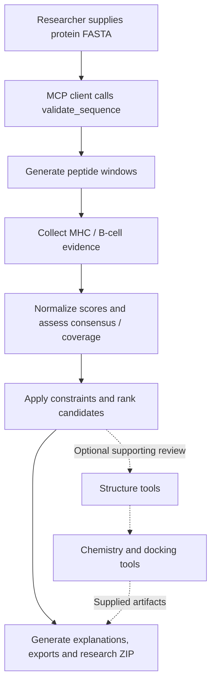
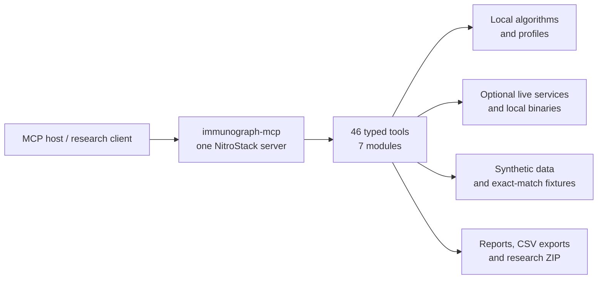

# 🧬 ImmunoGraph MCP

<p align="center">
  <strong>Typed research tools for computational epitope prioritization</strong><br />
  One MCP server · Explicit provenance · Reproducible offline demonstrations
</p>

<p align="center">
  
  
  
  
</p>

ImmunoGraph exposes sequence validation, prediction adapters, evidence processing, structure and chemistry utilities, docking adapters, and research-package export through **one NitroStack MCP application**. An MCP host can discover and call the tools individually. The server contains 46 registered tools across seven modules; the modules are **not** separate MCP servers.

> [!IMPORTANT]
> ImmunoGraph is computational research support. Its synthetic and fixture outputs are demonstrations, not experimental evidence. A candidate shortlist, docking pose, or generated report does not establish vaccine efficacy, safety, or clinical utility. Independent scientific review and experimental validation are required.

**Jump to:** [The problem](#the-research-problem) · [Our solution](#the-mcp-solution) · [End-to-end flow](#end-to-end-flow) · [All 46 tools](#tool-catalog) · [Quick start](#quick-start) · [Provenance](#provenance-and-scientific-use)

## The research problem

A protein sequence is only the starting point for an epitope study. Researchers often have to move between sequence validators, binding predictors, HLA coverage calculations, structure databases, chemistry tools, docking programs, and spreadsheets. These systems use different inputs, score scales, identifiers, and output formats. When results are copied between them, the source, configuration, and difference between a live calculation and an offline demonstration can become hard to audit.

Published studies show how many steps a real candidate search can require:

| Research case | What the researchers had to combine |
| --- | --- |
| [Grifoni et al., *Cell Host & Microbe* (2020)](https://doi.org/10.1016/j.chom.2020.03.002) | To identify candidate SARS-CoV-2 immune targets, the team compared SARS-CoV and SARS-CoV-2 sequences, used known SARS epitopes, predicted B- and T-cell epitopes, and checked conservation. These were candidate targets for follow-up, not a demonstrated vaccine. |
| [Ferreira et al., *PeerJ* (2021), EpiCurator](https://pmc.ncbi.nlm.nih.gov/articles/PMC8641484/) | The team analyzed 1,652 SARS-CoV-2 genomes from Brazil and combined epitope prediction with conservation, human-sequence homology checks, HLA population coverage, and computational construct assessment. Their paper explicitly notes that epitope curation required different web servers. |

That fragmentation makes a candidate shortlist difficult to reproduce and review. **ImmunoGraph addresses the integration and evidence-handling problem**; it does not determine whether a candidate is safe or effective in people.

## The MCP solution

ImmunoGraph packages the computational steps as typed tools behind one Model Context Protocol (MCP) server. A research client can discover the tools, call the ones needed for a study, pass structured evidence between them, and export a reviewable package.

| Research friction | What this MCP server provides |
| --- | --- |
| Disconnected programs and formats | One discoverable tool surface with validated inputs and structured responses |
| Incomparable or opaque outputs | Versioned score transformations, deterministic constraints/ranking, and explicit source labels |
| Hard-to-review handoffs | Run metadata, hashes, explanations, CSV/report tools, and a research ZIP assembled from supplied evidence |

Live scientific connectors are optional. The bundled synthetic data and exact-match fixtures make offline demonstrations repeatable, while retaining their demonstration provenance.

## MCP interface

`immunograph-mcp` is the deployable unit. An MCP host discovers and calls its tools; the server validates requests against their input schemas and returns structured results with execution metadata. Scientific results include source provenance where applicable. The seven tool modules are organized inside this **single server**.

| MCP surface | What it provides |
| --- | --- |
| Tools | 46 registered operations spanning sequence, evidence, constraints, structure, chemistry, docking, and export |
| Contracts | Zod input and output schemas with structured success or failure responses |
| Traceability | Run IDs, timestamps, input hashes, output hashes on success, and source labels for scientific data |
| Deployment | NitroStack application with configurable MCP transport; see [`.env.example`](.env.example) |

Clients can combine these tools in their own research workflow. Each operation remains callable on its own; the MCP server does not require five separate MCP installations.

## End-to-end flow


```mermaid
flowchart TD
    A["Researcher supplies protein FASTA"] --> B["MCP client calls validate_sequence"]
    B --> C["Generate peptide windows"]
    C --> D["Collect MHC / B-cell evidence"]
    D --> E["Normalize scores and assess consensus / coverage"]
    E --> F["Apply constraints and rank candidates"]
    F --> G["Generate explanations, exports and research ZIP"]
    F -.->|Optional supporting review| H["Structure tools"]
    H -.-> I["Chemistry and docking tools"]
    I -.->|Supplied artifacts| G
```

The arrows show a **recommended sequence of separate MCP tool calls by a client**. The server does not automatically execute the full chain. The client supplies the outputs and provenance needed by each later tool.

| Step | MCP calls | Result and decision point |
| --- | --- | --- |
| 1. Validate input | `validate_sequence` | Normalized protein sequence and SHA-256 identity, or an input error |
| 2. Create candidates | `generate_candidate_peptides` | One-based peptide windows; these are candidates, not predictions |
| 3. Gather evidence | `predict_mhci`, `predict_mhcii`, `predict_bcell` | MHC observations from enabled live connectors or matching fixtures; B-cell evidence is fixture-only, and synthetic binding is a separate demo tool |
| 4. Compare evidence | `normalize_scores`, consensus and population tools | Comparable derived values with method and population provenance |
| 5. Shortlist | Constraint tools, `rank_candidates`, optional shortlist/construct tools | Rule outcomes and deterministic preliminary or final ranks; final ranking requires completed constraints |
| 6. Review supporting structures | Structure, chemistry, and docking tools when configured | Supporting records and artifacts; these calls do not automatically alter the ranking score |
| 7. Export | Report, candidate, trace, and package tools | Caller-supplied evidence assembled into reports, CSV, and a checksummed ZIP |

**First practical boundary:** with live prediction disabled, an arbitrary new protein has no automatic scientific binding result. Exact fixtures only match their recorded inputs; the synthetic predictor is explicitly demonstration-only.

## Tool catalog

The server registers **46 tools in seven modules**. The descriptions below refer to the current handlers; “live” paths require explicit configuration, and demonstration paths retain their source labels. Complete input/output schemas are in [`src/modules/tool-contracts.ts`](src/modules/tool-contracts.ts) and the [`src/modules/`](src/modules/) controllers.

### Prediction · 6 tools

| Tool | What it does |
| --- | --- |
| `validate_sequence` | Validates one protein FASTA record and returns the normalized sequence, length, and SHA-256 hash. |
| `generate_candidate_peptides` | Creates stable, one-based MHC-I or MHC-II peptide windows for requested lengths. |
| `predict_mhci` | Resolves MHC-I binding observations through configured IEDB/MHCflurry paths or an exact fixture. |
| `predict_mhcii` | Resolves MHC-II binding observations through configured IEDB or an exact fixture. |
| `predict_bcell` | Replays B-cell residue/region evidence from an exact GraphBepi fixture; no live B-cell connector is implemented here. |
| `predict_synthetic_binding` | Computes deterministic offline demonstration binding values, labelled `SYNTHETIC` and unsuitable as scientific predictions. |

### Evidence and prioritization · 9 tools

| Tool | What it does |
| --- | --- |
| `normalize_scores` | Applies versioned transformations to raw predictor scores so later comparisons use a defined scale. |
| `compute_consensus` | Combines method observations into weighted consensus, agreement, and completeness for one candidate group. |
| `compute_consensus_batch` | Performs the same deterministic consensus calculation across multiple independent groups. |
| `calculate_population_coverage` | Calculates coverage through a configured service/script or an exact-match fixture. |
| `calculate_synthetic_population_coverage` | Calculates demonstration coverage from explicitly synthetic HLA frequencies. |
| `rank_candidates` | Computes profile-based preliminary scores or stable final ranks; final mode requires completed constraint results. |
| `optimize_shortlist_coverage` | Selects a T-cell shortlist using supplied candidates and coverage targets; local optimization output is marked demonstration-only. |
| `optimize_construct_genetic` | Runs seeded, deterministic construct optimization with coverage and redundancy constraints; output is demonstration-only. |
| `calibrate_confidence` | Derives a confidence value from scores, agreement, completeness, and evidence count without experimental calibration. |

### Constraints · 5 tools

| Tool | What it does |
| --- | --- |
| `detect_overlapping_epitopes` | Finds positional overlaps and connected components without deciding which candidate wins. |
| `remove_duplicate_candidates` | Collapses exact positional duplicates while preserving matching peptides at different coordinates. |
| `validate_thresholds` | Evaluates configured hard biological thresholds and returns rule outcomes. |
| `categorize_candidates` | Assigns deterministic candidate categories and blocking conditions from completed scores and rules. |
| `apply_constraint_rules` | Applies base, duplicate, and overlap rules to an immutable candidate snapshot. |

### Structure · 7 tools

| Tool | What it does |
| --- | --- |
| `fetch_structure` | Retrieves RCSB PDB/AlphaFold data when enabled, or returns a labelled fixture record. |
| `validate_structure` | Checks structure metadata before coordinate mapping or docking preparation. |
| `map_epitopes_to_structure` | Maps candidate sequence coordinates to a supplied structure reference. |
| `calculate_surface_accessibility` | Uses configured FreeSASA or returns fixture-safe accessibility summaries. |
| `calculate_structure_confidence` | Summarizes supplied structure metrics or labelled fixture defaults. |
| `detect_binding_pockets` | Uses configured fpocket, or returns a fixture result/failure according to the request. |
| `create_molstar_view` | Produces a Mol* view-state reference for a client visualization; it is not a built-in viewer. |

### Chemistry · 5 tools

| Tool | What it does |
| --- | --- |
| `fetch_compound` | Retrieves PubChem metadata when enabled or replays a labelled compound fixture. |
| `validate_compound` | Checks compound identity and basic molecular-string shape before downstream use. |
| `deduplicate_compounds` | Groups compounds by normalized SMILES-like identity. |
| `calculate_molecular_descriptors` | Uses RDKit when configured and requested; otherwise returns lightweight labelled estimates. |
| `prepare_ligand` | Invokes configured Open Babel or returns a fixture-labelled ligand artifact reference. |

### Docking · 5 tools

| Tool | What it does |
| --- | --- |
| `prepare_receptor` | Invokes configured receptor preparation tooling or returns a fixture-labelled reference. |
| `validate_docking_box` | Checks docking-box dimensions before an attempted docking run. |
| `run_docking` | Invokes configured AutoDock Vina or returns deterministic fixture-labelled poses. |
| `cluster_docking_poses` | Groups supplied pose data into representative pose clusters. |
| `extract_interactions` | Invokes configured PLIP or returns fixture-labelled interaction summaries. |

#### Molecular docking result

<p align="center">
  
</p>

<p align="center"><em>Actual molecular docking output generated by ImmunoGraph: RCSB 1UYD receptor, PubChem CID 2244 ligand, AutoDock Vina poses, and inferred contact geometry. <a href="oldreadme.md#docking-visualization">View the original result description</a>.</em></p>

### Reports and utilities · 9 tools

| Tool | What it does |
| --- | --- |
| `generate_report` | Creates report data from the supplied run and evidence snapshot. |
| `export_candidates` | Exports candidate records with raw and normalized score fields kept distinct. |
| `visualize_results` | Builds a validated visualization **view model** for a client to render. |
| `explain_candidate` | Explains a fixed candidate decision without changing its underlying scientific values. |
| `export_workflow_trace` | Exports an ordered, redacted trace of supplied events. |
| `describe_agentic_workflow` | Returns metadata about available stages, tool permissions, and approval gates. |
| `run_agentic_workflow` | Returns a stage trace from approved tool names; it does **not** execute those scientific tools. |
| `chat_with_research_agent` | Responds from a caller-supplied evidence summary and abstains when evidence is absent. |
| `export_research_package` | Returns a checksummed research ZIP as base64 content with artifact metadata, assembled from the supplied snapshot. |

The workflow/chat utility names are part of the MCP API. The client still makes each scientific tool call explicitly.

## Architecture


```mermaid
flowchart LR
    Host["MCP host / research client"] --> Server["immunograph-mcp<br/>one NitroStack server"]
    Server --> Tools["46 typed tools<br/>7 modules"]
    Tools --> Algorithms["Local algorithms<br/>and profiles"]
    Tools --> Live["Optional live services<br/>and local binaries"]
    Tools --> Fixtures["Synthetic data<br/>and exact-match fixtures"]
    Tools --> Export["Reports, CSV exports<br/>and research ZIP"]
```

The MCP server is registered in [`src/app.module.ts`](src/app.module.ts). Algorithms and data loaders are under `src/lib/`; tool handlers and connector adapters are under `src/modules/`. `data/` contains the reference manifests, profiles, schemas, and offline fixtures needed by the server. Run the application from the repository root so those files resolve correctly.

## Quick start

**Requirements:** Node.js 20.19.x and npm 10.x are the documented project target. Live scientific features additionally need their respective services, model downloads, or local binaries.

```bash
git clone https://github.com/Ajey95/immuno-graph.git
cd immuno-graph
npm ci
npm run build
npm start
```

The build compiles the MCP package. On startup, NitroStack registers the 46 tools. `npm run dev` is also available for NitroStack's development workflow. To customize runtime settings, copy [`.env.example`](.env.example) to `.env` and set only the capabilities you intend to use. Keep `data/` alongside the application when deploying; the reference and fixture loaders read from the repository root.

**Connecting an MCP host:** launch the built `dist/index.js` with the repository root as its working directory and choose a transport supported by your NitroStack/host setup. `.env.example` documents the transport settings. This repository does not ship a host-specific client configuration.

## MCP usage

Tools are independently callable. For example, an MCP client can call `validate_sequence` with:

```json
{
  "fasta": ">protein\nACDEFGHIK",
  "profileVersion": "mvp-v1.0"
}
```

The response contains a normalized sequence, its length and SHA-256 hash, or a structured validation error. `generate_candidate_peptides` can then create peptide windows. A research client must explicitly call the prediction, evidence, ranking, and export tools it needs and pass the resulting evidence between them.

For a standalone offline demonstration, the repository includes exact-match fixtures in `data/fixtures/` and a separate `predict_synthetic_binding` tool. Fixture-backed prediction only succeeds when the protein reference **and** method, allele, peptide-length, and parameter selectors match an approved fixture. An arbitrary new sequence is not automatically given a fixture prediction.

## Optional live connectors

Most live connectors are **disabled by default**. These switches are defined in [`src/modules/config/environment.ts`](src/modules/config/environment.ts):

| Capability | Enablement | Additional dependency |
| --- | --- | --- |
| IEDB MHC binding | `IEDB_LIVE_ENABLED=true` | Network access to a compatible IEDB endpoint |
| IEDB population coverage | `IEDB_POPULATION_COVERAGE_ENABLED=true` | Configured endpoint or standalone script |
| MHCflurry | `MHCFLURRY_ENABLED=true` | Installed CLI and downloaded models |
| RCSB PDB / AlphaFold DB | `RCSB_PDB_ENABLED=true` / `ALPHAFOLD_DB_ENABLED=true` | Network access |
| PubChem | `PUBCHEM_ENABLED=true` | Network access |
| RDKit / Open Babel | `RDKIT_ENABLED=true` / `OPENBABEL_ENABLED=true` | Installed Python package or binary and valid chemistry inputs |
| FreeSASA / fpocket | `FREESASA_ENABLED=true` / `FPOCKET_ENABLED=true` | Installed binaries and valid structure inputs |
| AutoDock Vina / PLIP | `VINA_ENABLED=true` / `PLIP_ENABLED=true` | Installed binaries and valid docking inputs |

## Provenance and scientific use

Every tool returns structured success or failure data. Scientific outputs identify how they were produced: `LIVE` for a configured connector, `FIXTURE` for an approved replay, and `SYNTHETIC` for demonstration-only calculations. The server does not present fixture or synthetic values as live measurements.

Live connector paths require external services, model downloads, or installed binaries. GraphBepi is fixture-only in this version. An MCP tool or exported research package is a computational artifact; it is not experimental or clinical validation.

## Repository map

```text
src/app.module.ts          NitroStack MCP application and module registration
src/modules/               MCP tool controllers and connector adapters
src/lib/algorithms/         Local deterministic algorithms
src/lib/database/           Data/fixture/profile loaders and validation
data/reference/             Reference manifests and versioned records
data/profiles/              Ranking and biological-constraint profiles
data/fixtures/              Exact-match offline demonstration cases
```

## Verification

For the MCP package reviewed on 6 October 2026: `npm ci` and `npm run build` completed, and `npm start` initialized the server with **46 tools** after the full `data/` directory was present. Live connector results and scientific accuracy were not verified by that check.

---

**Research carefully.** Keep inputs, configuration, provenance, and reviewer decisions with every exported result.
