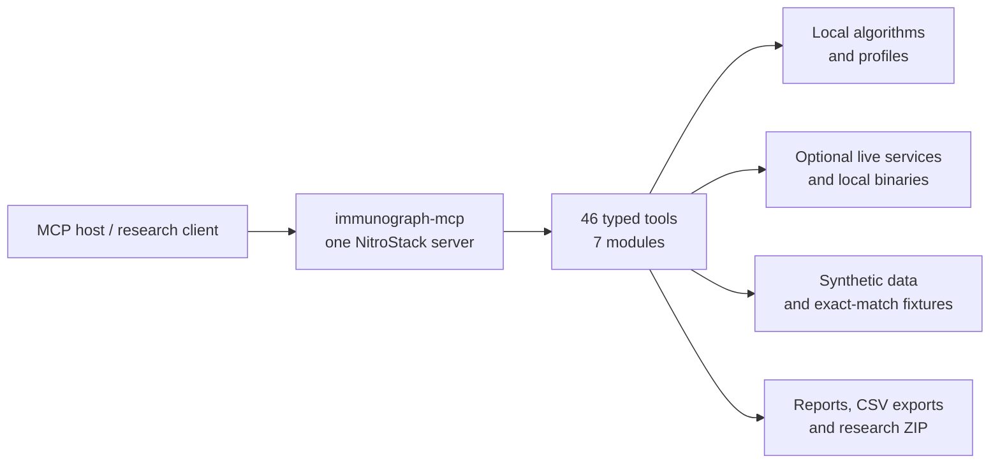

# 🧬 ImmunoGraph MCP

<p align="center">
  <strong>Typed research tools for computational epitope prioritization</strong><br />
  One MCP server · Explicit provenance · Reproducible offline demonstrations
</p>

<p align="center">
  
  
  
  
</p>

ImmunoGraph exposes sequence validation, prediction adapters, evidence processing, structure and chemistry utilities, docking adapters, and research-package export through **one NitroStack MCP application**. An MCP host can discover and call the tools individually. The server contains 46 registered tools across seven modules; the modules are **not** separate MCP servers.

> [!IMPORTANT]
> ImmunoGraph is computational research support. Its synthetic and fixture outputs are demonstrations, not experimental evidence. A candidate shortlist, docking pose, or generated report does not establish vaccine efficacy, safety, or clinical utility. Independent scientific review and experimental validation are required.

**Jump to:** [MCP interface](#mcp-interface) · [Tool catalog](#tool-catalog) · [Architecture](#architecture) · [Quick start](#quick-start) · [Provenance](#provenance-and-scientific-use)

## MCP interface

`immunograph-mcp` is the deployable unit. An MCP host discovers its tools, validates requests against their input schemas, and receives structured results with provenance and execution metadata. The seven scientific modules are organized inside this **single server**.

| MCP surface | What it provides |
| --- | --- |
| Tools | 46 registered operations spanning sequence, evidence, constraints, structure, chemistry, docking, and export |
| Contracts | Zod input and output schemas with structured success or failure responses |
| Traceability | Run IDs, timestamps, input hashes, output hashes on success, and source labels for scientific data |
| Deployment | NitroStack application with configurable MCP transport; see [`.env.example`](.env.example) |

Clients can combine these tools in their own research workflow. Each operation remains callable on its own; the MCP server does not require five separate MCP installations.

## Tool catalog

| Module | Tools | Examples | Current execution boundary |
| --- | ---: | --- | --- |
| Prediction | 6 | `validate_sequence`, `generate_candidate_peptides`, `predict_mhci`, `predict_mhcii`, `predict_bcell` | IEDB and MHCflurry are optional; GraphBepi is fixture-only. A separate synthetic predictor is available for demonstrations. |
| Evidence | 9 | `normalize_scores`, `compute_consensus`, `rank_candidates`, `calculate_population_coverage` | Deterministic calculations use supplied evidence; live population coverage requires explicit configuration. |
| Constraints | 5 | `validate_thresholds`, `detect_overlapping_epitopes`, `apply_constraint_rules` | Local rule and overlap calculations. |
| Structure | 7 | `fetch_structure`, `map_epitopes_to_structure`, `detect_binding_pockets` | RCSB/AlphaFold lookups and FreeSASA/fpocket paths require enabled connectors or local binaries; fixture paths exist. |
| Chemistry | 5 | `fetch_compound`, `calculate_molecular_descriptors`, `prepare_ligand` | PubChem, RDKit, and Open Babel paths require explicit setup; fixture paths exist. |
| Docking | 5 | `prepare_receptor`, `run_docking`, `extract_interactions` | AutoDock Vina and PLIP paths require local binaries; the offline path returns labelled fixture results. |
| Reports & utilities | 9 | `generate_report`, `export_candidates`, `export_research_package` | Reports, CSV exports, and research ZIPs are assembled from supplied data. |

Tool inputs are validated with Zod. Tool responses include structured success or failure data and metadata such as the tool name, run ID, timestamps, and input/output hashes. The complete schemas live in [`src/modules/tool-contracts.ts`](src/modules/tool-contracts.ts) and the individual controllers in [`src/modules/`](src/modules/).

## Architecture


```mermaid
flowchart LR
    Host["MCP host / research client"] --> Server["immunograph-mcp<br/>one NitroStack server"]
    Server --> Tools["46 typed tools<br/>7 modules"]
    Tools --> Algorithms["Local algorithms<br/>and profiles"]
    Tools --> Live["Optional live services<br/>and local binaries"]
    Tools --> Fixtures["Synthetic data<br/>and exact-match fixtures"]
    Tools --> Export["Reports, CSV exports<br/>and research ZIP"]
```

The MCP server is registered in [`src/app.module.ts`](src/app.module.ts). Algorithms and data loaders are under `src/lib/`; tool handlers and connector adapters are under `src/modules/`. `data/` contains the reference manifests, profiles, schemas, and offline fixtures needed by the server. Run the application from the repository root so those files resolve correctly.

## Quick start

**Requirements:** Node.js 20.19.x and npm 10.x are the documented project target. Live scientific features additionally need their respective services, model downloads, or local binaries.

```bash
git clone https://github.com/Ajey95/immuno-graph.git
cd immuno-graph
npm ci
npm run build
npm start
```

The build compiles the MCP package. On startup, NitroStack registers the 46 tools. `npm run dev` is also available for NitroStack's development workflow. To customize runtime settings, copy [`.env.example`](.env.example) to `.env` and set only the capabilities you intend to use. Keep `data/` alongside the application when deploying; the reference and fixture loaders read from the repository root.

**Connecting an MCP host:** launch the built `dist/index.js` with the repository root as its working directory and choose a transport supported by your NitroStack/host setup. `.env.example` documents the transport settings. This repository does not ship a host-specific client configuration.

## MCP usage

Tools are independently callable. For example, an MCP client can call `validate_sequence` with:

```json
{
  "fasta": ">protein\nACDEFGHIK",
  "profileVersion": "mvp-v1.0"
}
```

The response contains a normalized sequence, its length and SHA-256 hash, or a structured validation error. `generate_candidate_peptides` can then create peptide windows. A research client must explicitly call the prediction, evidence, ranking, and export tools it needs and pass the resulting evidence between them.

For a standalone offline demonstration, the repository includes exact-match fixtures in `data/fixtures/` and a separate `predict_synthetic_binding` tool. Fixture-backed prediction only succeeds when the protein reference **and** method, allele, peptide-length, and parameter selectors match an approved fixture. An arbitrary new sequence is not automatically given a fixture prediction.

## Optional live connectors

Most live connectors are **disabled by default**. These switches are defined in [`src/modules/config/environment.ts`](src/modules/config/environment.ts):

| Capability | Enablement | Additional dependency |
| --- | --- | --- |
| IEDB MHC binding | `IEDB_LIVE_ENABLED=true` | Network access to a compatible IEDB endpoint |
| IEDB population coverage | `IEDB_POPULATION_COVERAGE_ENABLED=true` | Configured endpoint or standalone script |
| MHCflurry | `MHCFLURRY_ENABLED=true` | Installed CLI and downloaded models |
| RCSB PDB / AlphaFold DB | `RCSB_PDB_ENABLED=true` / `ALPHAFOLD_DB_ENABLED=true` | Network access |
| PubChem | `PUBCHEM_ENABLED=true` | Network access |
| AutoDock Vina and other local tools | Individual flags such as `VINA_ENABLED=true` | Installed binaries and valid inputs |

## Provenance and scientific use

Every tool returns structured success or failure data. Scientific outputs identify how they were produced: `LIVE` for a configured connector, `FIXTURE` for an approved replay, and `SYNTHETIC` for demonstration-only calculations. The server does not present fixture or synthetic values as live measurements.

Live connector paths require external services, model downloads, or installed binaries. GraphBepi is fixture-only in this version. An MCP tool or exported research package is a computational artifact; it is not experimental or clinical validation.

## Repository map

```text
src/app.module.ts          NitroStack MCP application and module registration
src/modules/               MCP tool controllers and connector adapters
src/lib/algorithms/         Local deterministic algorithms
src/lib/database/           Data/fixture/profile loaders and validation
data/reference/             Reference manifests and versioned records
data/profiles/              Ranking and biological-constraint profiles
data/fixtures/              Exact-match offline demonstration cases
```

## Verification

For the MCP package reviewed on 6 October 2026: `npm ci` and `npm run build` completed, and `npm start` initialized the server with **46 tools** after the full `data/` directory was present. Live connector results and scientific accuracy were not verified by that check.

---

**Research carefully.** Keep inputs, configuration, provenance, and reviewer decisions with every exported result.
